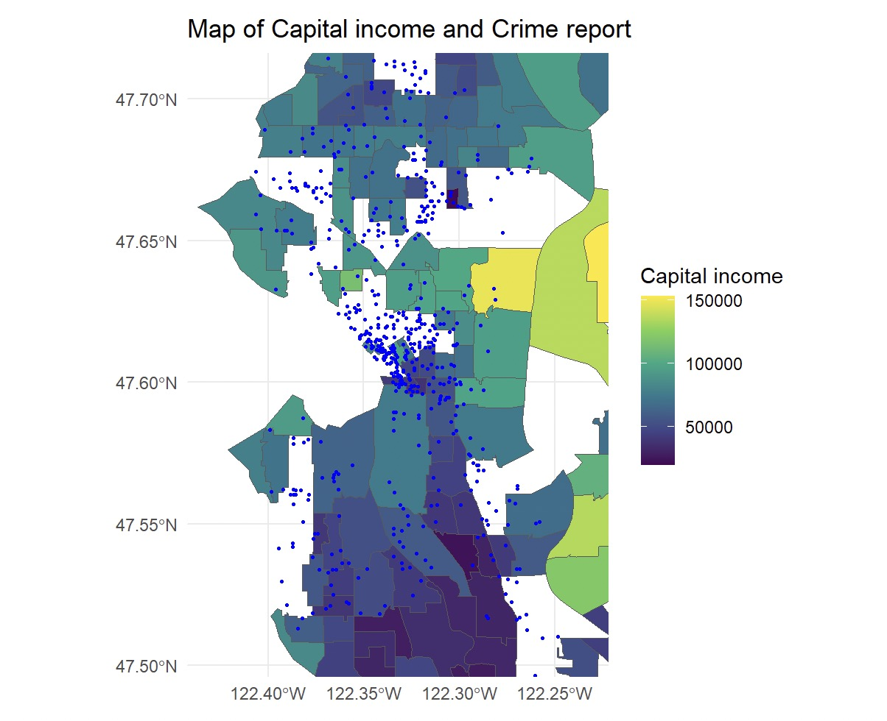
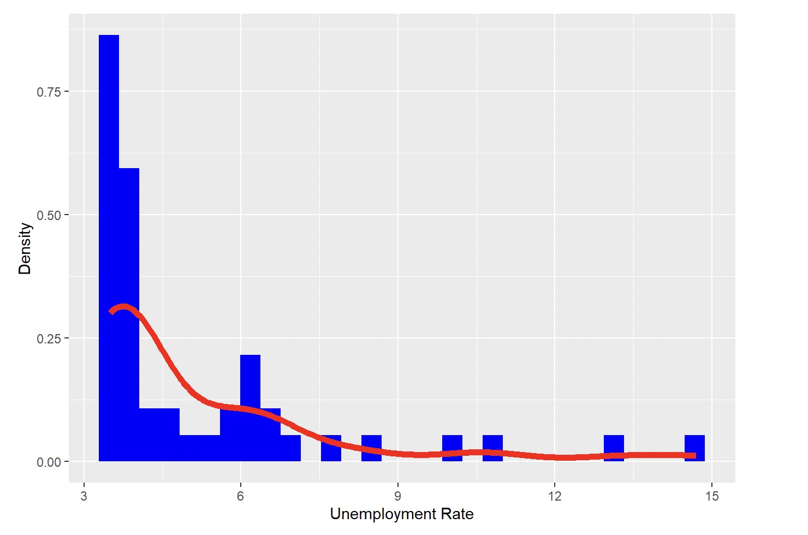
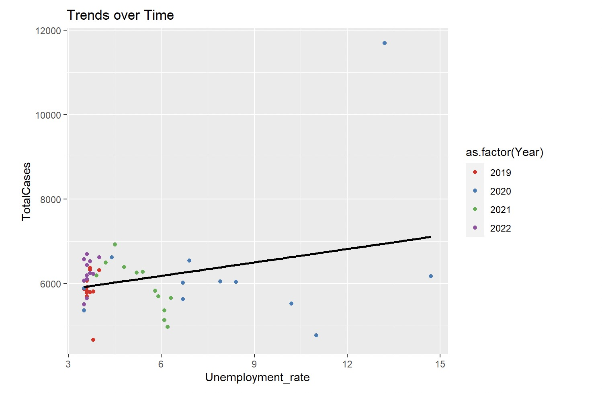

# Info201_final_ADgroup5
# Crime Trends and Socioeconomic Analysis Project
---
## Project Summary: Understanding the Relationship Between Economic Factors and Crime Rates
---
In "Understanding the Relationship Between Economic Factors and Crime Rates," an interdisciplinary study authored by Yixuan, the project investigates the complex relationship between key economic indicators, such as the Consumer Price Index (CPI) and unemployment rates, and crime rates. This research is pivotal in blending elements of economics, sociology, and criminology to understand how economic downturns, especially reflected in rising unemployment, influence crime rates. 

The study's methodology includes a detailed analysis of economic data and crime statistics. A key figure generated from this analysis (Figure 1) illustrates the trend correlation between unemployment rates and incidents of crime over the past decade. This figure, derived from national economic and law enforcement databases, visually represents the direct relationship between higher unemployment rates and increased crime rates.

Target Audience: This research is primarily aimed at policymakers, law enforcement agencies, sociologists, and economists. The findings provide crucial insights for these stakeholders, aiding in strategic planning and policy formulation. By understanding the economic predictors of crime, policymakers and law enforcement can better allocate resources and implement targeted interventions to maintain public safety and order. Additionally, the study serves as a valuable resource for academicians and researchers interested in the socio-economic determinants of crime.
